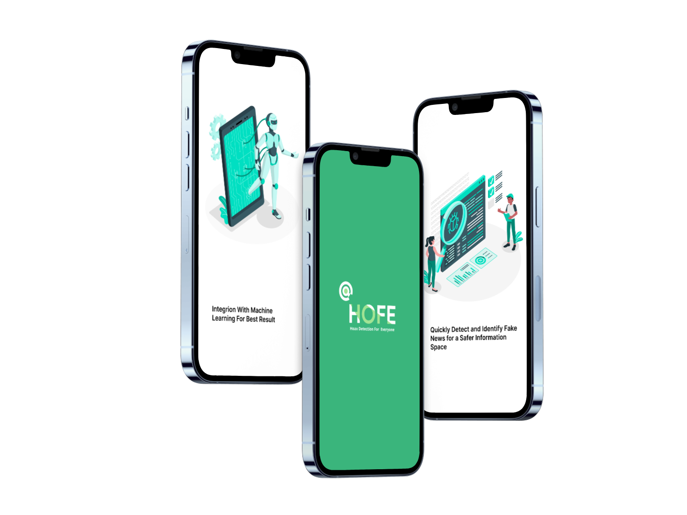

# HOFE ( Hoax Detection For Everyone )

## Background

Our project seeks to develop a Hoax Detection application, targeting the critical challenge of misinformation that pervades Indonesian media landscapes. Our problem statement focuses on the need for an automated and intelligent application capable of detecting and reducing the spread of misinformation, which increasingly threatens social harmony and public trust in vital areas such as health and governance. Although there are already similar applications available, we aim to achieve a highly reliable hoax detection accuracy. Through our research questions, we aim to determine the efficacy of machine learning algorithms in detecting hoaxes in real time and to identify key linguistic and contextual features that distinguish misinformation. Additionally, we investigate the broader implications of hoaxes on public opinion and decision-making.

In terms of background, Indonesia is witnessing a surge in hoaxes, with studies showing that a large portion of the population is exposed to false information, primarily through news articles. This unchecked spread has spurred public uncertainty and, in some cases, social unrest—particularly around health crises like COVID-19 and sensitive political events.
This tool will empower individuals to distinguish between truth and falsehood, promoting informed public discourse, bolstering confidence in credible news sources, and contributing to a well-informed society. This initiative reflects our commitment to addressing the misinformation crisis and to advancing media literacy through actionable technology.

## Main Features

#### 1. **Predict News**
Submit a **news link** and get a prediction about whether the news is a **hoax** or **valid**. This is the main feature of HOFE, providing you with an instant check on news authenticity.

#### 2. **Check Hoax News**
View a list of **hoax news** that has been verified. Each entry includes the title, link, and description of the news article.

#### 3. **Login**
Login to the application using your **email** and **password**. You will receive a **token** that grants access to other features.

#### 4. **Register**
Create a new account with a **username**, **email**, and **password**. Once registered, you can log in and start using the app.

#### 5. **Logout**
Log out of the app to securely end your session. Your **token** will be removed to ensure the safety of your account.

#### 6. **User Profile**
View your **user profile**. Currently, the profile section is under development and shows "empty!"

## Our Team

| Name                               | University                        | Learning Path | LinkedIn                         |
| ---------------------------------- | --------------------------------- | ------------- | -------------------------------- |
| Ardhian Jaya Wibawa                | Politeknik Pratama Mulia          | ML            | [LinkedIn](https://www.linkedin.com/in/ardhian-jaya/)                          |   
| M Dicky Desriansyah                | Universitas Dharma Andalas       | ML      | [LinkedIn](https://www.linkedin.com/in/m-dicky-desriansyah-23a79b2aa/)                    |
| Aji Maulana                        | Politeknik Pratama Mulia          | ML            | [LinkedIn](https://www.linkedin.com/in/aji-maulana-0bb20921b)                    |
| Seva Nonda Farkhan Syah            | Universitas Gunadarma             | ML            | [LinkedIn](https://www.linkedin.com/in/seva-nonda-farkhan-syah-0ab311247/)                    |
| Zahra Areefa Ananta                | Institut Teknologi Sumatera       | ML            | [LinkedIn](https://www.linkedin.com/in/zahra-areefa-ananta-28566124b/)                    |
| Bani Adam Tampubolon               | Institut Teknologi Sumatera       | ML            | [LinkedIn](https://www.linkedin.com/in/baniadamtampubolon)                    |

## Resource
|  Learning Path                | Branch                               |
|------------------------------ |--------|
| Cloud-Computing               | [CC](https://github.com/ajimaulana123/HOFE-hoax-detection-for-everyone/tree/cc) |
| Mobile Development            | [MD](https://github.com/ajimaulana123/HOFE-hoax-detection-for-everyone/tree/md) |
| Machine-learning              | [ML](https://github.com/ajimaulana123/HOFE-hoax-detection-for-everyone/tree/ml) |
